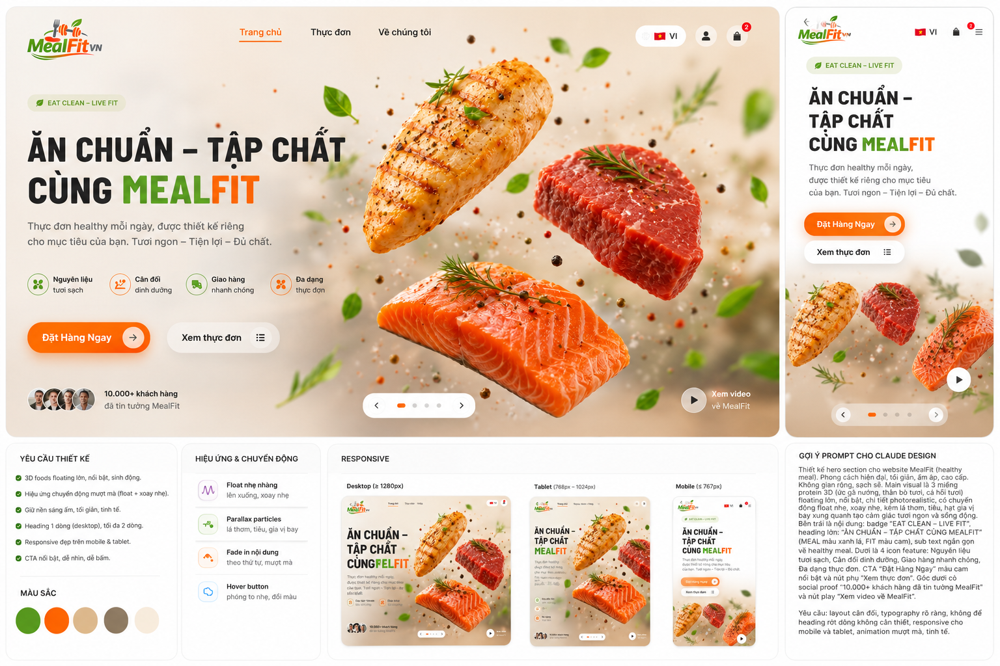

Tôi đã tham khảo lại hướng dẫn thiết kế hero trong tài liệu nội bộ và đánh giá các thiết kế bạn gửi. Hero cần tập trung vào cảm giác “ngon miệng” và thúc đẩy người dùng đặt món ngay【turn9file0†L3-L17】; nền nên sáng ấm, có các thành phần (rau, gà, cá hồi…) trôi nhẹ【turn9file0†L18-L24】, và bố cục phải rõ ràng, CTA nổi bật.

Dưới đây là gợi ý prompt cho Claude Design (hoặc công cụ thiết kế tương tự) và một mẫu thiết kế minh họa bạn có thể tham khảo:

### Prompt gợi ý cho Claude Design (tiếng Việt)

> **Thiết kế hero section cho website MealFit (thương hiệu ăn sạch):** Nền gradient ấm áp với họa tiết rau thơm, hạt tiêu và gia vị bay nhẹ nhàng. Ba miếng thực phẩm **3D không bao bì** (ức gà, thăn bò, cá hồi) lớn, chất lượng cao, nổi và xoay nhẹ theo trục, với đổ bóng và cảm giác “bật ra” khỏi nền. Áp dụng chuyển động **parallax** khi người dùng di chuột để tạo chiều sâu và sự sinh động. Bố cục tối giản, tinh tế với headline “Ăn chuẩn – Tập chất Cùng MealFit” rõ ràng, không ngắt dòng tùy tiện. Bên dưới là subheading mô tả ngắn về thực đơn healthy và 2 nút CTA “Đặt Hàng Ngay” (màu cam) và “Xem thực đơn” (màu trắng viền cam). Sử dụng bảng màu ấm (beige, xanh lá, cam) và biểu tượng đơn giản cho lợi ích (nguyên liệu tươi, cân đối dinh dưỡng, giao hàng nhanh, đa dạng). Đảm bảo thiết kế responsive: trên mobile, sắp xếp hình và text theo cột dọc; trên tablet, thu gọn kích thước thịt và giữ tiêu đề không bị tràn dòng. Chuyển động mượt mà, tự nhiên, không quá rối mắt.

### Mẫu thiết kế minh họa

Để bạn dễ hình dung, mình đã tạo một bản mockup hoàn thiện hơn với các miếng thịt 3D lớn và hiệu ứng hạt gia vị bay, bố cục responsive (desktop, tablet, mobile). Bạn có thể dùng làm reference khi chỉnh sửa trong Claude:

Điểm nhấn của mẫu này:

* **Miếng thịt lớn, bật ra**: Các miếng ức gà, thăn bò, cá hồi được phóng to, xoay nhẹ và có bóng đổ, giúp thu hút ánh nhìn và tạo cảm giác premium.
* **Nền động nhẹ**: Hạt tiêu, lá và gia vị trôi lơ lửng tạo chiều sâu nhưng vẫn giữ sự tối giản; ánh sáng ấm áp hỗ trợ màu sắc món ăn.
* **Bố cục sạch và dễ đọc**: Headline không bị xuống dòng khi chưa hết ý, subheading gọn gàng. Các nút CTA nổi bật bằng màu sắc tương phản.
* **Responsive**: Mockup đi kèm các layout desktop (≥1280px), tablet (768–1024px) và mobile (≤768px) với cách sắp xếp thành phần phù hợp, đảm bảo trải nghiệm thống nhất.

Khi áp dụng prompt và tham khảo mockup, hãy đảm bảo sử dụng ảnh sản phẩm chất lượng cao (định dạng PNG nền trong suốt) để giữ độ sắc nét và sử dụng các lớp chuyển động khác nhau (float, rotate, parallax) để làm thiết kế sống động nhưng không quá rối.
