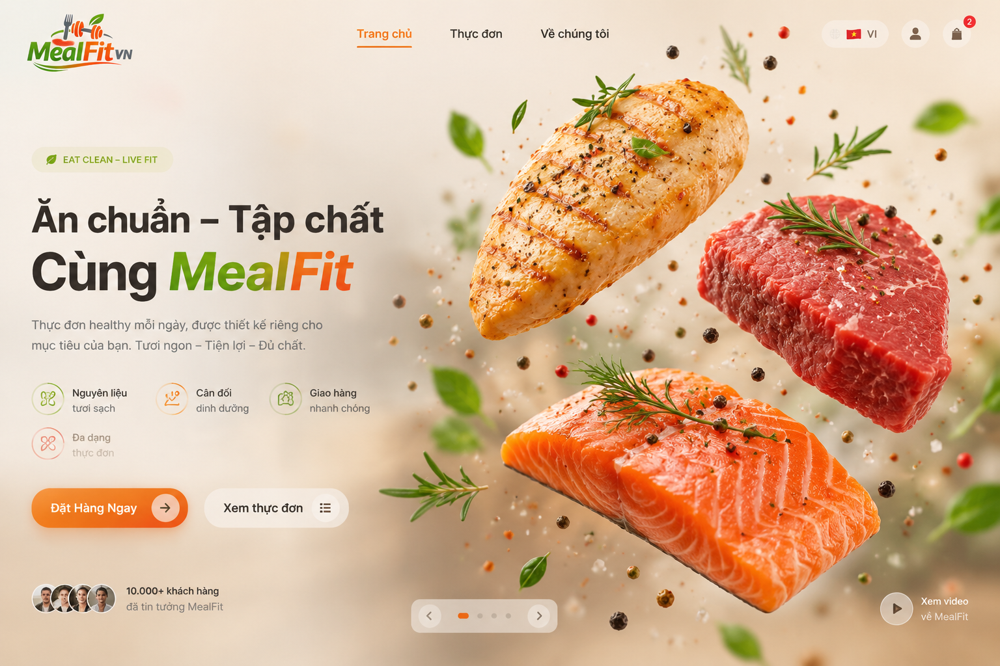

Tôi đã xem cấu trúc mã nguồn trang Mealfit, cũng như file hướng dẫn “redesign‑home‑page.md” và các component hiện có. Hero hiện tại đang sử dụng một video Remotion (MealHero) và các icon emoji làm vòng tròn nguyên liệu. Dưới đây là đề xuất triển khai một hero mới với các miếng ức gà, thăn bò và cá hồi 3D nổi trên nền động theo đúng yêu cầu.

### Ý tưởng thiết kế

* **Tập trung vào sản phẩm** – hero cần khiến người dùng “thấy ngon và muốn đặt ngay”. File hướng dẫn yêu cầu hero có hình ảnh món ăn sắc nét, headline ngắn gọn, CTA rõ ràng và hiệu ứng animate nhẹ【turn9file0†L3-L17】.
* **Nền ấm, sạch với hiệu ứng động** – doc gợi ý nên có nền sáng ấm, ingredient floating nhẹ nhàng (rau, cà chua, trứng, gà, cá hồi, hạt, herbs)【turn9file0†L18-L24】. Component `AmbientBackground` sẵn có đã có orbs gradient và các nguyên liệu trôi【turn10file0†L3-L6】; có thể giữ nguyên và đặt canvas 3D trên đó.
* **3D thực phẩm** – sử dụng React Three Fiber (R3F) và Drei để tải và hiển thị các model `.glb` của ức gà, thăn bò, cá hồi. Blog của Vercel nêu rõ R3F giúp xây dựng đồ họa 3D tương tác dễ dàng trong React; các model GLB tối ưu cho web và có thể import trực tiếp. Canvas 3D nên dùng light (ambient và directional) để tạo cảm giác tự nhiên và có component `<Float />` của Drei để làm các miếng thịt nổi/đung đưa nhẹ.

### Kiến trúc thực hiện

1. **Chuẩn bị asset**
   Tải các model 3D chất lượng cao (định dạng `.glb`) cho ức gà, thăn bò, cá hồi (có thể lấy từ Sketchfab/CGTrader). Đặt chúng trong thư mục `public/models/`. Nếu không có model, tạm dùng hình sản phẩm với hiệu ứng parallax hoặc video loop.

2. **Cài đặt thư viện**
   Trong dự án Next.js, cài các phụ thuộc:

   ```bash
   npm install three @react-three/fiber @react-three/drei
   ```

   R3F sẽ sử dụng WebGL và cần chạy trên phía client.

3. **Tạo component 3D** (`components/home/Hero3D.tsx`)

   ```tsx
   'use client';
   import { Canvas } from '@react-three/fiber';
   import { Float, Environment, useGLTF } from '@react-three/drei';
   import { Suspense } from 'react';

   // Tải model GLB; Drei sẽ caching nội dung.
   function Meat({ url, ...props }) {
     const { scene } = useGLTF(url);
     return <primitive object={scene} {...props} />;
   }

   export default function Hero3D() {
     return (
       <div className="w-full h-full">
         <Canvas camera={{ position: [0, 0, 6], fov: 50 }}>
           {/* ánh sáng mềm mại */}
           <ambientLight intensity={0.8} />
           <directionalLight position={[5, 5, 5]} intensity={1.2} />
           {/* môi trường HDRI để phản chiếu dịu nhẹ */}
           <Suspense fallback={null}>
             <Environment preset="sunset" />
             {/* cá hồi nổi */}
             <Float floatIntensity={1} rotationIntensity={0.7} speed={1.5}>
               <Meat url="/models/salmon.glb" scale={1.8} position={[0, 0, 0]} />
             </Float>
             {/* ức gà nổi ở trái */}
             <Float floatIntensity={1.2} rotationIntensity={0.8} speed={1.8}>
               <Meat url="/models/chicken.glb" scale={1.6} position={[-2.3, -0.3, -1]} />
             </Float>
             {/* thăn bò nổi ở phải */}
             <Float floatIntensity={1.1} rotationIntensity={0.6} speed={1.6}>
               <Meat url="/models/beef.glb" scale={1.7} position={[2.3, -0.5, -1]} />
             </Float>
           </Suspense>
         </Canvas>
       </div>
     );
   }
   ```

   Component `Float` của Drei tự động tạo hiệu ứng lơ lửng và xoay chậm. Bạn có thể điều chỉnh `floatIntensity`, `rotationIntensity` và `speed` để phù hợp.

4. **Kết hợp vào hero**
   Thay `HeroVisual` bằng component này hoặc xuất thêm lựa chọn. Ví dụ sửa `components/home/HeroVisual.tsx` như sau:

   ```tsx
   import Hero3D from './Hero3D';
   // …
   export function HeroVisual() {
     const reduced = useReducedMotion();
     return (
       <motion.div /* y như cũ */>
         {reduced ? (
           <StaticHero />
         ) : (
           <div className="aspect-[4/3] w-full overflow-hidden rounded-[2rem] border border-meal-green/10 shadow-[0_44px_100px_-44px_rgba(71,56,36,0.5)]">
             <Hero3D />
           </div>
         )}
         {/* badge giữ nguyên */}
       </motion.div>
     );
   }
   ```

   Khi người dùng bật “prefers‑reduced‑motion”, trang sẽ dùng `StaticHero` sẵn có (một ảnh tĩnh với icon). Nếu không, canvas 3D sẽ được hiển thị.

5. **Tinh chỉnh CSS**
   Giữ `AmbientBackground` hiện có để tạo các quầng sáng và điểm lấm tấm phía sau【turn10file0†L3-L6】. Đặt canvas 3D phía trên nền bằng cách dùng `relative z-10` cho wrapper. Chọn palette màu ấm – kem, xanh lá, cam cà rốt – như hướng dẫn trong doc.

6. **CTA và nội dung**
   Đảm bảo headline, subheadline, CTA “Đặt món ngay”/“Xem thực đơn” vẫn nằm ở cột bên trái của hero như hiện tại. Phần mô tả có thể nhắc tới các loại protein chính (“ức gà, thăn bò, cá hồi, tôm…”)【turn9file0†L9-L17】. Sử dụng motion hay `Framer Motion` để làm reveal mượt mà.

### Minh họa giao diện

Hình dưới đây minh họa concept hero mới với các miếng thịt nổi 3D trên nền gradient ấm và các họa tiết herbs. Đây là hình mẫu, không phải asset chính thức nhưng giúp hình dung bố cục.



### Kết luận

Giải pháp trên tuân theo yêu cầu về hero section: nền ấm sạch, sản phẩm được đặt trung tâm, ingredient floating nhẹ【turn9file0†L18-L24】, CTA rõ ràng và hiệu ứng animation tự nhiên. Việc sử dụng React Three Fiber để tải các model GLB giúp tạo trải nghiệm tương tác sống động mà vẫn dễ tích hợp vào dự án Next.js. Nếu không muốn dùng 3D, bạn có thể thay thế bằng video loop hoặc GIF động của món ăn.
